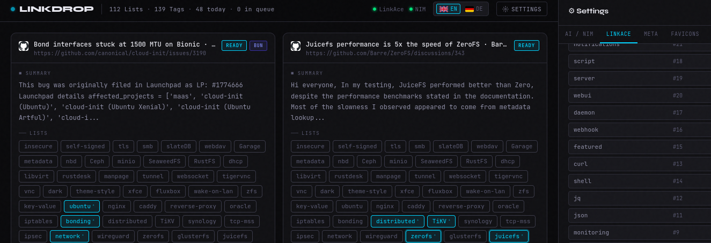

# linkdrop
Automated linkace assistant 

* loads links via drag n drop or paste
* fancy UI 
* ability to use NVIDIA NIM for auto selection of lists and tags

# LINKDROP — Changelog

Single-file AI-powered bookmark manager with LinkAce & Nvidia NIM integration.

---

## v10 — Bookmarklet
- New **🔖 Bookmarklet** tab in the settings panel
- Generator produces minified `javascript:` code that runs on any page without CORS
- Bookmarklet reads `document.title`, `meta description` / `og:description` and optionally selected text
- LINKDROP opens in a new tab with GET parameters `?url=&title=&desc=&focus=1`
- Card is created immediately with the passed metadata — no CORS fetch required
- `history.replaceState` removes parameters after reading (prevents duplicate card on reload)
- Drag-to-bookmarks-bar button + copy-to-clipboard
- Own URL is auto-detected and pre-filled on first open
- `fetchMeta` never overwrites bookmarklet-provided metadata, only improves it

---

## v9 — Create list directly from the dropdown
- `+ New list…` input field pinned to the bottom of the `+N more ▾` dropdown
- Enter or Create button creates the list in LinkAce immediately
- New list is auto-selected on the card and registered in the usage counter
- Chips row and `+N more` counter update without closing the dropdown
- Input retains focus for rapid creation of multiple lists

---

## v8 — Card colors, tab reorder, top-42 lists, single NIM request, retry buttons
**Card border colors by save status**
- Saved → amber border
- HTTP 422 (link already exists) → blue border + "Duplicate" badge
- Other errors → red border + HTTP code badge

**Two discard buttons**
- `✕ Discard all` — remove all cards
- `✓ Discard saved` — remove only successfully saved cards

**Per-stage retry buttons** (appear automatically on error)
- `↺ Meta` — re-fetch metadata
- `↺ NIM` — push card to front of queue
- `↺ Save` — retry the LinkAce POST

**Settings tab order** rearranged: Lists → Tags → LinkAce → AI/NIM → Meta → Favicons → Archive → Backup

**New Tags tab** with search and create functionality

**Top-42 lists on cards**
- Sort order: selected first → most used → alphabetical
- `+N more ▾` opens a searchable dropdown for all remaining lists
- Click usage is counted per list in localStorage (`list_usage`)

**NIM: single request instead of two**
- Prompt contains description, title, URL and a merged candidates array of both lists and tags
- If a list and a tag share the same name, the model may suggest both — intentional

---

## v7 — Drag & drop for all browsers
- `text/x-moz-url` — Firefox history & bookmarks (incl. multi-select): alternating URL/title lines
- `text/uri-list` — Chrome, Edge, Safari: one URL per line, `#` comment lines are skipped
- `text/html` — Chrome multi-select history: `<a href="…">` anchors are extracted
- `text/plain` — plain fallback as before
- Toast shows received MIME types when no URL is recognized
- Browser console logs full content of all types for diagnosis
- `extractURLs` now strips trailing punctuation from matched URLs

---

## v6 — Internationalization (i18n)
- Default language changed to English
- Two `<script type="application/json">` blocks in `<head>` for EN and DE (~70 keys each)
- `t(key)` function + `data-i18n` attributes on all static strings
- Language switcher (flag buttons) in the status bar
- Inline SVG fallback flags for DE (black-red-gold) and EN (Union Jack)
- Remote languages: Settings → Language → Translation URL, loads `translation_XY.json`
- `country.json` from remote server for base64 SVG flags
- Loaded languages are cached in localStorage
- All dynamic strings (badges, toasts, modals) translated via `t()`
- `langname_XY` fields in each translation file for display names in other languages

---

## v5 — List merge
- Automatically detects duplicate list names after loading
- Amber `⊕ N duplicate group(s)` button appears only when duplicates exist
- Duplicate lists highlighted in amber in the list view with "(Duplicate)" label
- Merge dialog shows exactly which lists are kept and which are dissolved
- Algorithm: fetch all links from duplicate list (paginated) → add to target via `PUT /links/{id}` → delete duplicate
- Live log of every step with success/error status
- Pagination: 100 links per page, full processing even for large lists
- Automatically reloads list overview after completion

---

## v4 — LinkAce 500 bugfix
- **`list_ids` → `lists`** — correct field name per LinkAce API spec
- **Tags as plain strings** — `["foo"]` instead of `[{name:"foo"}]`
- **API version selector** (v1/v2): v1 sends `is_private: false`, v2 sends `visibility: 1`
- **Actual error text** from response body — Laravel `message` / `errors` fields extracted and shown
- **Debug box** in the LinkAce tab displays the last error persistently
- `laReq` now reads the JSON body of error responses

---

## v3 — NIM CORS proxy protocol toggle
- Removed auth header input fields (API key is sent automatically as `Authorization: Bearer`)
- Added checkbox "Include protocol (`https://`) in path"
- Default (unchecked): `http://myproxy:1234/integrate.api.nvidia.com/v1/…`
- Checked: `http://myproxy:1234/https://integrate.api.nvidia.com/v1/…`
- Live NIM URL preview in the settings panel
- Placeholder changed to `http://myproxy:1234` to hint at expected format

---

## v2 — Full feature build
**NIM queue**
- Queue manager with status bar showing count and current item
- Hover over card → pauses that card's NIM job, moves it to end of queue
- Manual click on list/tag chip → card promoted to front of queue (⚡ NIM now button)
- List name found in page title → pre-selected with outline highlight
- NIM summary replaced by metadata extraction (description from `og:description` etc.)

**NIM endpoint configuration**
- Radio: Direct vs. Custom CORS proxy with real-time URL preview
- HTTP 404 on test → explicit message that the selected model may not support this request
- Language detection from title/metadata (40+ languages/frameworks)
- Stack Overflow sites extract tags from URL slugs

**CORS error tracking**
- After 3 global failures: red badge on card + one-time modal with link to proxy settings

**Meta proxy** (Meta tab): NIM proxy or custom proxy, test against google.com checks `Authorization` in `Access-Control-Allow-Headers`

**Favicon proxies** (Favicons tab): custom proxies first (`{domain}` / `{url}` placeholders), fallback chain Google → Yandex → Yahoo → DuckDuckGo

**Archive URLs** (Archive tab): per-domain rules or global `*`, Archive button on cards

**Scraper services** (Meta tab): configurable service list (cloudflare-worker-scraper compatible), order first/fallback

**NSFW mode**: NIM & external favicon services only after clicking "👁 Load external" per card

**Backup** (Backup tab): JSON export/import for config, LinkAce data, or full backup

**List management**: create new lists directly in the LinkAce tab

---

## v1 — Initial build
- Single-file Vanilla HTML/JS/CSS, no build step required
- Global paste listener (`CTRL+V`) + drag & drop over the entire viewport with URL auto-detection (regex)
- LinkAce API: loads all lists and tags on startup, credentials stored in localStorage
- Nvidia NIM API: one request per dropped link, suggests matching lists and tags as pre-selected chips
- Card UI: favicon, title, URL, AI-generated summary, list/tag chips, save/discard buttons
- Settings panel: LinkAce URL + token, NIM API key + model selector, connection test buttons
- Status bar: live connection indicators (green/amber/red dots) for LinkAce and NIM
- Toast notifications (no `alert()`)
- `CTRL+S` saves all pending links · `ESC` closes the settings panel
- Daily saved-link counter persisted in localStorage
- Responsive layout — single column on mobile
---

<a href="https://the-foundation.gitlab.io/">
<h3>A project of the foundation</h3>

</a>
